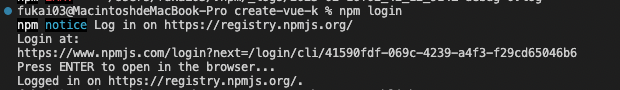
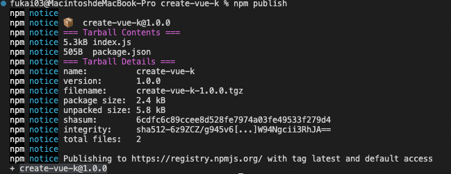

# scaffold-demo

## 脚手架学习demo

* 脚手架（scaffold）：CLI、初始化（create-reate-app、vue-cli）
* 前端脚手架是一种快速构建项目的工具，它可以帮助开发人员快速搭建项目的框架，并且已经预先配置了必要的开发环境。使用前端脚手架可以省去许多前期的构建工作，提高开发效率。此外，前端脚手架还可以保证项目的结构、代码质量、可维护性等方面的一致性，使得项目开发更加高效和可靠。
随着前端工程化的理念不断深入，脚手架的出现就是为减少重复性工作而引入的命令行工具，众所周知, 新建项目是很繁琐的一项工作， 要考虑项目目录结构，基础库的配置,  各种规范等等. 在此过程中如何摆脱ctrl + c/v，而通过脚手架从零到一搭建项目的方式变得更加有必要.
* 对于很多系统，他们的页面相似度非常高，所以就可以基于一套模板来搭建，虽然是不同的人开发，但用脚手架来搭建，相同的项目结构与代码书写规范，是很利于项目的后期维护的，让项目从"搭建-开发-部署"更加快速以及规范
### 命令行界面工具
* commander:https://github.com/tj/commander.js
* inquirer:https://github.com/SBoudrias/Inquirer.js
* ora:https://github.com/sindresorhus/ora?spm=a21iq3.home.0.0.297f27646WDX6h
* chalk:https://github.com/chalk/chalk?spm=a21iq3.home.0.0.297f27646WDX6h

### 初始化工具
* create-react-app（react官方初始化工具，基于webpack）：https://create-react-app.dev/
* vue-cli(基于webpack，目前已处于维护模式):https://cli.vuejs.org/zh/
* create-vue(官方推荐，基于vite)：https://github.com/vuejs/create-vue
* vite（使用vite提供的模板同样可以快速初始化项目）：https://cn.vitejs.dev/guide/#scaffolding-your-first-vite-project
  * vite社区模板：https://github.com/vitejs/awesome-vite#templates
脚手架工具入口文件参考
* vite：https://github.dev/vitejs/vite/blob/main/packages/create-vite/src/index.ts
* create-react-app:https://github.dev/facebook/create-react-app/packages/create-reate-app/createReactApp.js
* umi:https://github.dev/umijs/umi/packages/create-umi/src/index.ts

### 自定义前端脚手架
* 以上官方提供的脚手架工具能够使得开发者快速搭建并启动一个项目，通过部分配置的修改就能够满足项目的开发需求，提供了广泛意义上的最佳实践。但随着业务的积累，针对某些场景，开发者总结出该场景下的最佳实践，即该场景下沿用这一套配置流程即可满足项目需求， 官方提供的工具已然不满足开发者的需求，这时候就可以针对一些特定场景开发该场景的脚手架。
#####  搭建monorepo环境
* monorepo是指在一个大的项目仓库中，管理多个模块/包（package），这种类型的项目大都在项目根目录下有一个packages文件夹，分多个项目管理，即单仓库多项目。如Vant、ElementUI、Vue3、vite等均采用该模式。
  * 如vite：https://github.dev/vitejs/vite/blob/main/packages/create-vite/index.js
* 新建my-vue-cli-demo文件夹，并初始化package.json
mkDir my-vue-cli-demo && cd my-vue-cli-demo && pnpm init
* 新建并配置.npmrc文件。设置shamefully-hoist为true来提升那些不在根目录的node_modules，将安装的深层级的依赖包都放到同一级别（扁平化），防止某些工具仅在根目录的node_modules时才有效而可能导致的bug。
```bash
shamefully-hoist = true
```
#####  初始化及monorepo实现
* 新建一个pnpm-workspace.yaml文件将包关联起来，通过以下配置能将项目下的packages目录下的所有包关联起来，若需关联其他目录直接在文件中添加配置即可。

```yaml
packages:
    - 'packages/**'
```
* 新建packages文件夹，并在其目录下分别创建两个文件夹进行初始化。其中create-vue-k为脚手架工具包，cli-demo为测试用的demo。

```bash
mkDir create-vue-k && cd create-vue-k && pnpm init
mkDir cli-demo && cd cli-demo && pnpm init
```

#####  脚手架简单实现及本地测试
* 在create-vue-k的package.json中新增bin属性然后指向index.js。因为开发的不是工具包，所以去掉main属性。
  * bin的作用可见npm官方文档：https://docs.npmjs.com/cli/v6/configuring-npm/package-json#bin
* 新建create-vue-k/index.js作为脚手架入口
> 注意cli入口文件需要加#! /usr/bin/env node指定脚本的解释程序为node，否则会抛出 No such file or directory 错误

```js
#! /usr/bin/env node
console.log("hello my-cli")
```
* 在cli-demo中安装本地脚手架，可以在package.json看到依赖，并在启动脚本中添加脚手架命令，如下图所示。

```bash
pnpm add create-vue-k
```


* 执行pnpm run create-vue-k，即可看到控制台中打印出 hello my-cli 文字


##### 解析用户输入参数，形成交互式命令
* 可使用原生process.argv 来获取用户输入的参数，在index.js中添加 console.log(process.argv)，并在 create-vue-k 的控制台输入 node index.js --name k --version 1.0，可看到控制台打印如下信息

* 使用原生指令较为麻烦，所以建议采用第三方工具库来获取用户参数
  * command-line-args ： 获取用户参数
  * command-line-usage： 配置帮助信息
  * chalk： 美化控制台信息
  * prompts：交互式命令

```bash
pnpm add command-line-args command-line-usage chalk prompts -S
```
> 注意由于以下使用了es6的语法,所以需要将package.json中的type指定为module

```js
import commandLineArgs from 'command-line-args';
import commandLineUsage from 'command-line-usage';
import chalk from 'chalk';

const promptsOptions = [
    {
        type: 'text',
        name: 'name',
        message: '项目名',
        validate(val) {
            if (!val) return '模板名称不能为空！';
            if (fs.existsSync(val)) return '项目名已存在'
            if (val.match(/[^A-Za-z0-9\u4e00-\u9fa5_-]/g)) return '模板名称包含非法字符，请重新输入';
            return true;
        }
    },
    {
        type: 'text',
        name: 'password',
        message: '版本'
    },
    {
        type: 'select',//单选
        name: 'template',
        message: '模板选择',
        choices: [
            { title: 'vue2', value: 1 },
            { title: 'vue3', value: 2 },
            { title: 'react', value: 3 }
        ]
    },
]

// 获取信息
const getInputInfo = async () => {
    const res = await prompts(promptsOptions)
    console.log(res)
}

//帮助内容
const helpSections = [
    {
        header: 'create-vue-k',
        content: '一个自定义快速生成项目环境的脚手架',
    },
    {
        header: 'Options',
        optionList: [
            {
                name: 'version',
                typeLabel: '{underline boolean}',
                description: '版本号',
            },
            {
                name: 'template',
                typeLabel: '{underline string}',
                description: '模板',
            },
            {
                name: 'arg',
                typeLabel: '{underline number}',
                description: '参数',
            },
        ],
    },
];

// 配置命令参数
const optionDefinitions = [
    { name: 'help', alias: 'h', type: Boolean },
    { name: 'version', alias: 'v', type: Boolean },
    { name: 'arg1', type: String },
    { name: 'arg2', type: Number },
]

const options = commandLineArgs(optionDefinitions)

if (options.help) {
    console.log(chalk.green(commandLineUsage(helpSections)));
} else {
    console.log(options);
    getInputInfo()
}
```

* 以上配置执行效果如下


#####  拉取模板
* 当获取到用户输入或选择的信息的时候,我们就可以输出对应模板给用户。可使用远程拉取的方式来完成和拉取脚手架内部模板两种方式

###### 拉取远程模板
* 安装download-git-repo,使用其的clone方法，并安装 ora 来实现拉取模板时的loading状态

```bash
pnpm add download-git-repo ora -S
```

```js
import ora from 'ora';
import download from 'download-git-repo';

// 远程模板地址
const remoteList = {
    1: 'https://github.com/lstoeferle/vite-vue2-windicss-starter.git',
    2: 'https://github.com/antfu/vitesse.git',
    3: 'https://github.com/wtchnm/Vitamin.git'
}

// 模板克隆函数
const gitClone = (remote, name, option) => {
    const downSpinner = ora('正在下载模板...').start();
    return new Promise((resolve, reject) => {
        download(remote, name, option, err => {
            if (err) {
                downSpinner.fail();
                console.log("err", chalk.red(err));
                reject(err);
                return;
            };
            downSpinner.succeed(chalk.green('模板下载成功！'));
            console.log(`Done. Now run:\r\n`);
            console.log(chalk.green(`cd ${name}`));
            console.log(chalk.blue("npm install"));
            console.log("npm run dev\r\n");
            resolve();
        });
    });
};

// 根据用户输入的信息进行相应的模板克隆
const branch = 'main'
const getInputInfo = async () => {
    const res = await prompts(promptsOptions)
    console.log(res)
    if (!res.name || !res.template) return
    gitClone(`direct:${remoteList[res.template]}#${branch}`, res.name, { clone: true })
}
```

###### 拉取脚手架内部分支
* 首先在create-vue-k文件夹内新建一个文件夹用于存放模板，如创建template-vue3文件夹作为一个脚手架内部模板
* 修改index.js文件
  * 修改选项配置，新增 { title: 'vue3-local', value: 5 }作为拉取脚手架内部模板选项

```js
const promptsOptions = [
// ...
    {
        type: 'select',//单选
        name: 'template',
        message: '模板选择',
        choices: [
            { title: 'vue2', value: 1 },
            { title: 'vue3', value: 2 },
            { title: 'react', value: 3 },
            { title: 'react-ts', value: 4 },
            { title: 'vue3-local', value: 5 },
        ]
    },
]
```
* 新增克隆文件函数
```js
// 脚手架本地模板克隆函数
const localClone = (templateName, projectName) => {
    // 模板路径
    const tempDir = path.resolve(
        fileURLToPath(import.meta.url),
        './..',
        `${templateName}`,
    )
    // 目标路径
    const destDir = path.join(process.cwd(), projectName)

    // 创建文件夹
    fs.mkdir(destDir, { recursive: true }, (err) => {
        if (err) throw err
    })


    // 将模板下的文件全部转换到目标目录
    rw(tempDir, destDir, {name: projectName})

    // 成功后的打印
    console.log(`Congratulations! Project '${projectName}' has been created successfully~`)

}
/**
 * @description 模板文件的读取、渲染以及生成
 * @param tempDir 模板路径
 * @param destDir 目标路径
 * @param answer 用户输入的内容
 */
const rw = (tempDir, destDir, answer) => {
    try {
        // console.log(tempDir, destDir);
        const files = fs.readdirSync(tempDir)

        files.forEach(file => {
            const filePath = path.join(tempDir, file)
            const targetDir = path.join(destDir, file)

            const stats = fs.statSync(filePath)

            if (stats.isFile()) {
                if (destDir.includes('img') || destDir.includes('fonts') || destDir.includes('icon') || destDir.includes('.ico')) {
                    const readStream = fs.createReadStream(filePath)
                    const writeStream = fs.createWriteStream(targetDir)
                    readStream.pipe(writeStream)
                } else {
                    ejs.renderFile(filePath, answer, (err2, res) => {
                        if (err2) throw err2
                        // 将渲染完成后的结果写入目标路径
                        fs.writeFileSync(path.join(destDir, file), res)
                    })
                }
            } else {
                fs.mkdirSync(targetDir)
                rw(filePath, targetDir, answer)
            }
        })

    } catch (e) {
        throw e
    }
}
```
* 修改获取用户交互信息函数的判断条件，修改完后即可根据用户选项拉取远程或脚手架内部模板。
```js
// 获取用户交互信息并处理
const getInputInfo = async () => {
// ...
    if (res.template > 4) { // 拉取脚手架本地模板
        let templatename = templateNameList[res.template] || 'template-vue3'
        console.log(templatename);
        localClone(templatename, res.name)
    } else { // 拉取线上模板
        gitClone(`direct:${remoteList[res.template][0]}#${remoteList[res.template][1]}`, res.name, { clone: true })
    }

}
```

#####  本地测试
* 以上步骤基本完成了一个脚手架的本地搭建，进入到cli-demo文件夹中进行本地验证。通过以下视频中的操作，即可看到在cli-demo文件夹下新增了test文件夹，进入该文件夹中安装依赖即可运行改模板

#####  发布
* 在create-vue-k文件夹下执行npm login登录npm

* 执行npm publish即可发布

* 在npm官网上就能看到刚刚发布的脚手架


#####  使用
* 在cli-demo文件夹下，删除node_modules
* 安装脚手架

```bash
npm i create-vue-k
```
* 执行脚手架命令，通过选择拉取模板

```bash
npx create-vue-k
```
